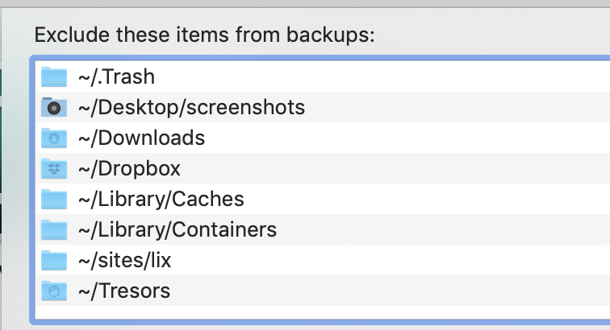

  

> My personal guide for setting up new machines.

## Getting Started

1. Download this repo as a `.zip`
2. Open Terminal and give it full disk access
3. Set system preferences - run `sh scripts/set_preferences.sh`
4. [Install things](install_things.md)

## Other guides

### Development setup

[Guide for dev setup](development.md)

### SSH keys

1. Generate new key: `ssh-keygen -t rsa -b 4096 -C "nedergaardmads@gmail.com"`
2. [Add to ssh-agent](https://help.github.com/en/github/authenticating-to-github/generating-a-new-ssh-key-and-adding-it-to-the-ssh-agent#adding-your-ssh-key-to-the-ssh-agent)
3. Add key to relevant sites (e.g. Github, GCP, etc.)
   - **Github:** `pbcopy < ~/.ssh/id_rsa.pub` and add it under "Github > Settings > SSH and GPG Keys"

### Theming

- [Alfred theme](https://www.alfredapp.com/extras/theme/yZODAdxN8T/) - [github repo](https://github.com/michelegera/alfred-snazzy)
- VSCode should follow from settings-sync
- [Hyper](https://github.com/sindresorhus/hyper-snazzy)
- Slack `#282A36,#324050,#324050,#57C7FF,#324050,#EFF0EB,#5AF78E,#FF5C57`
- Terminal: Use zsh and [pure prompt](https://github.com/sindresorhus/pure)

### Timemachine exclusions

### Spotlight exclusions

- `~/dev`
- `~/Dropbox`
- `~/Library`
- `/System`
- `/usr`

---

## Inspiration

- https://sourabhbajaj.com/mac-setup/
- https://github.com/adamisntdead/DevMyMac
- https://github.com/pshirshov/initmac
- https://gist.github.com/kevinelliott/ab14cfb080cc85e0f8a415b147a0d895
